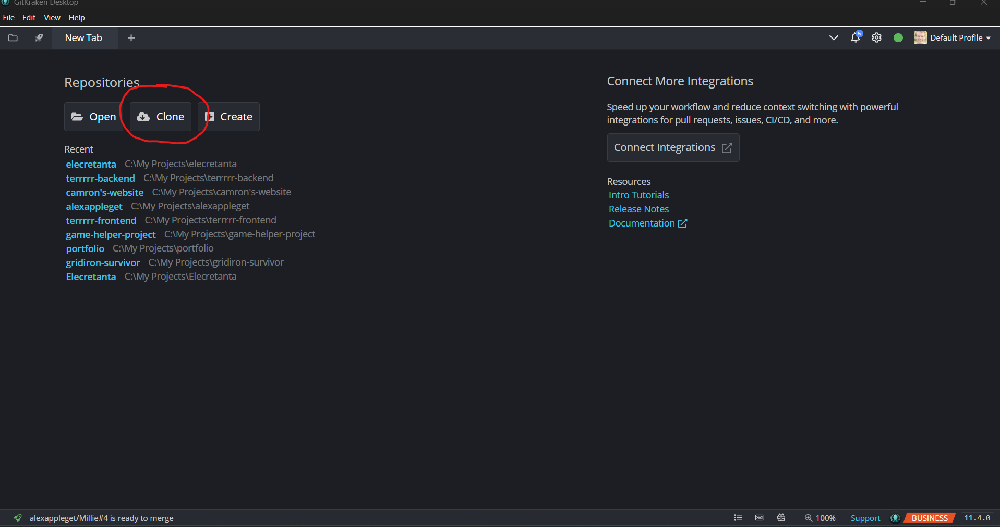
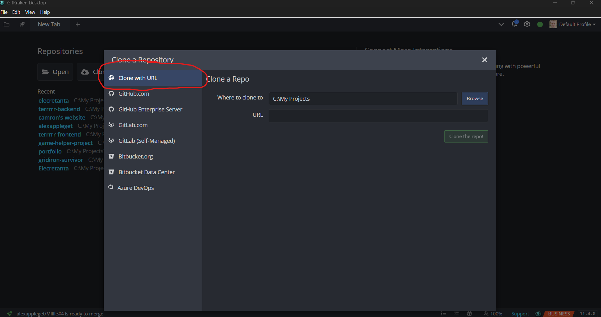
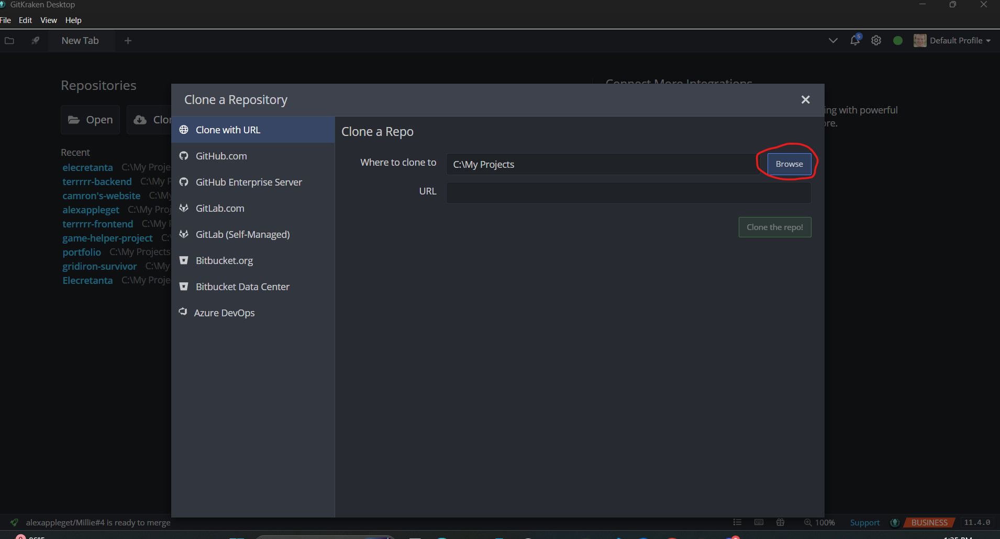
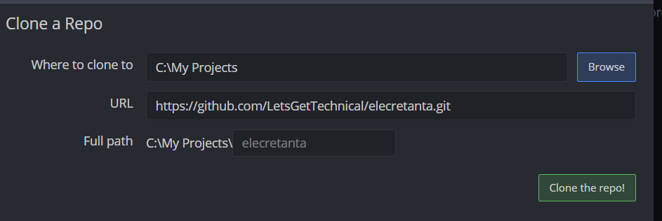
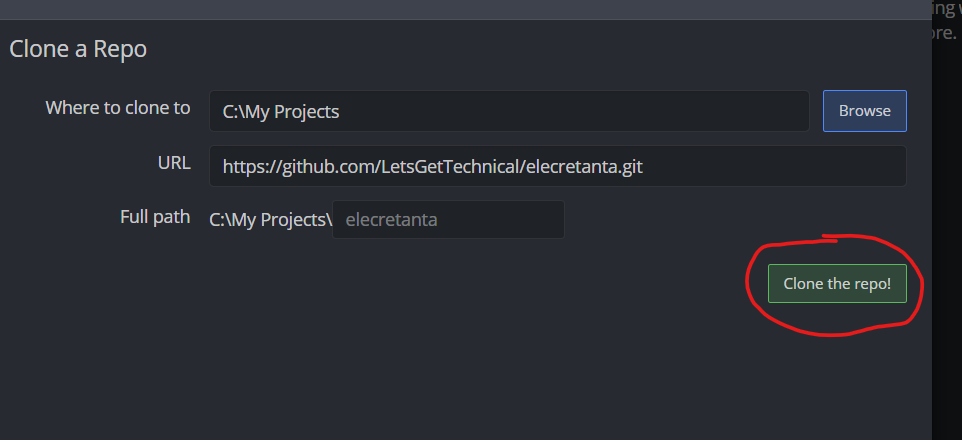

# Cloning the Repository with GitKraken

So, I see you decided not to be a drooling monkey and chose to use GitKraken. GitKraken is one of our sponsors that gives us free access to use it for our team. It's a modern Git GUI that makes working with repositories easier and more visual. Here's how to clone our project using GitKraken:

## Prerequisites

- Make sure you have [GitKraken installed](https://www.gitkraken.com/download) on your computer.
- Make sure you have a GitHub account and are logged in to GitKraken.

## Steps

1. **Open GitKraken.**
2. **Click on the "Clone" button** in the new tab it opens up with.
   
3. A pop up window will appear. Make sure **Clone with URL** is selected in the sidebar.
   
4. **Click the "Browse" button** to choose where you want the project saved on your computer.
   
5. **Copy and paste this URL into the URL field:**
   ```
    https://github.com/LetsGetTechnical/elecretanta.git
   ```
   
   > **Note:** A `Full path` input will pop up under this. You can leave leave it as the default name `elecretanta`, or type a name you prefer. It won't affect anything.
6. **Click "Clone the Repo!"** and the project is now on your computer!
   

## Next Steps

- Open your terminal in VS Code and run:
  ```sh
  pnpm i
  ```
  to install all necessary dependencies.

> **Important:** We use `pnpm` and NOT `npm`. Do not use `npm`.

If you have any trouble, ask for help in Discord!
